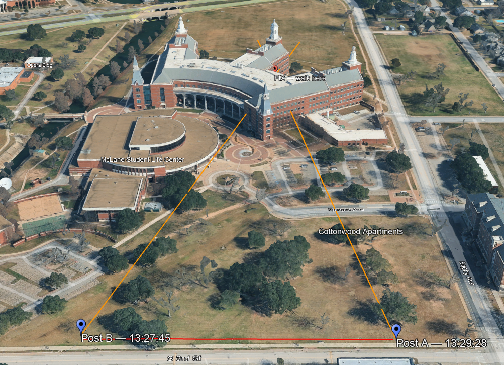
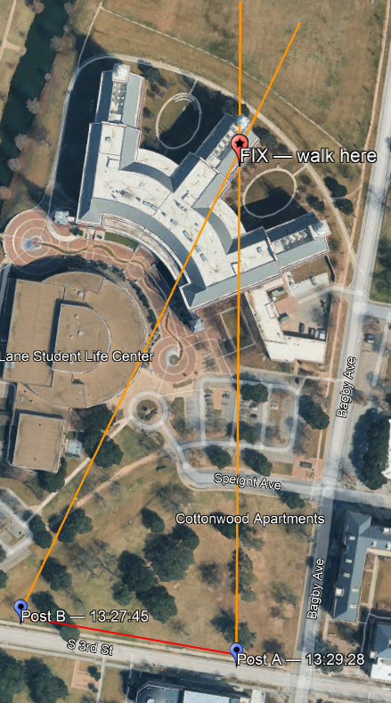
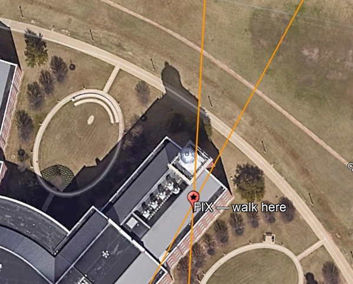
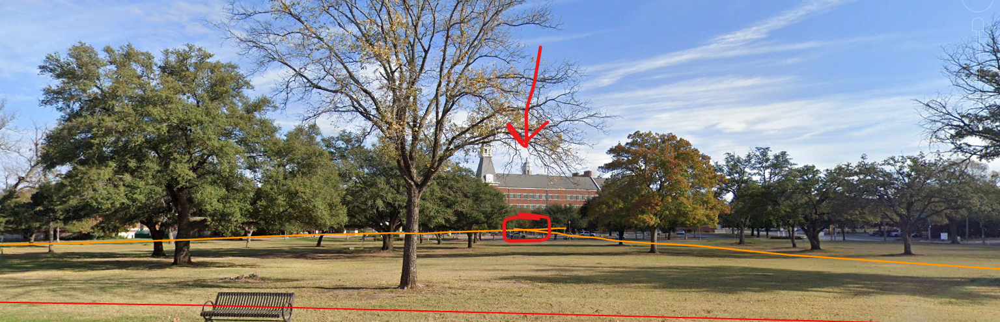
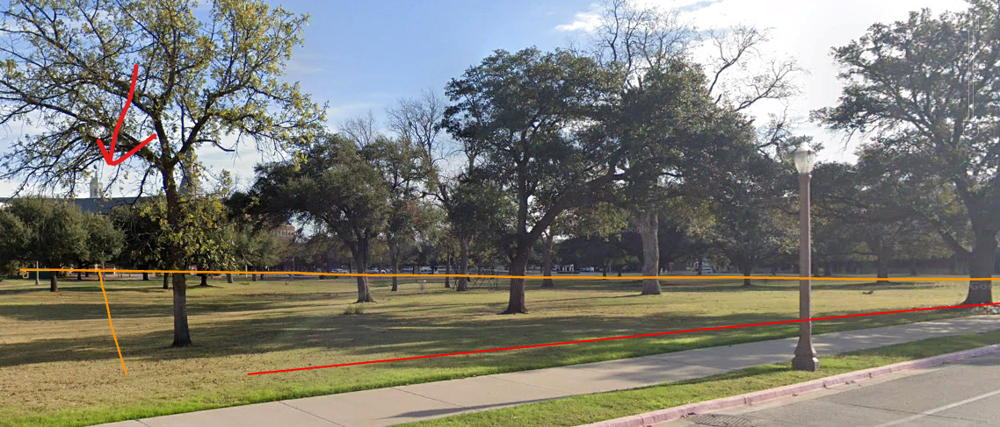
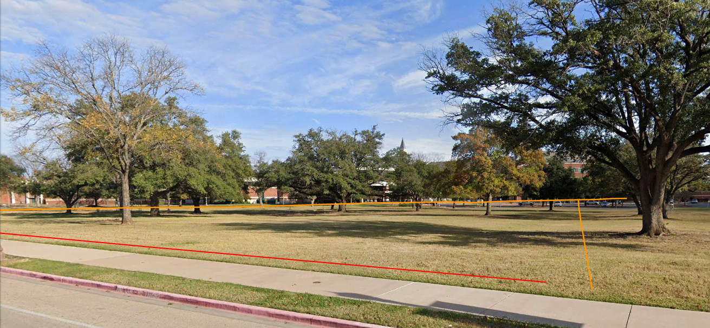
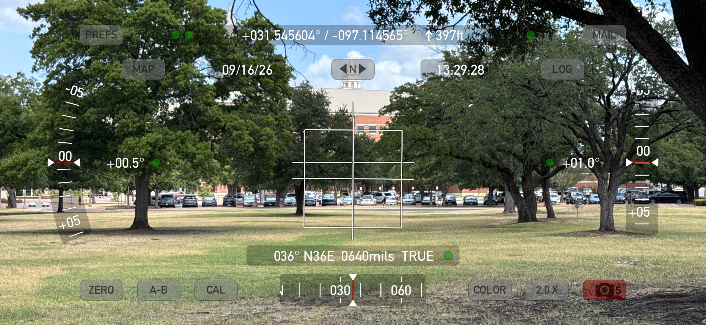
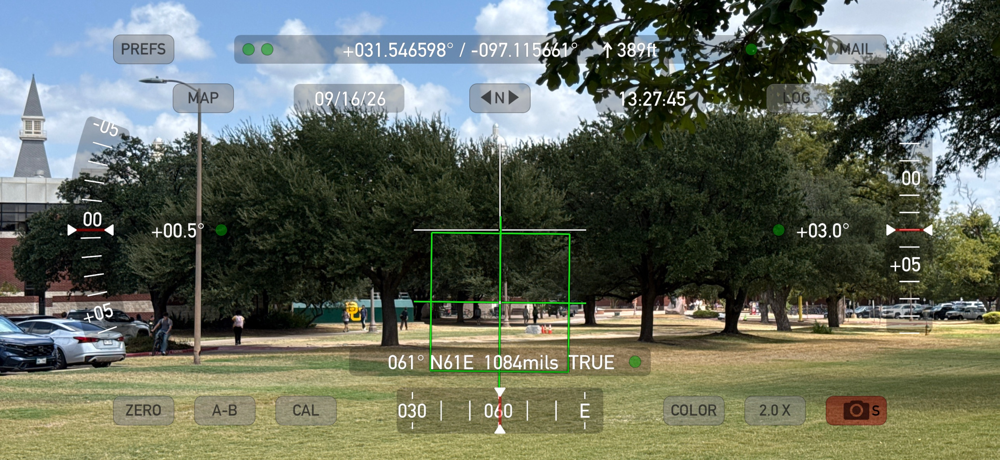
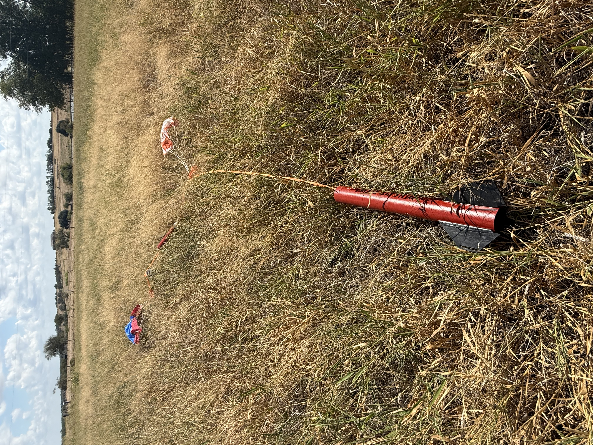
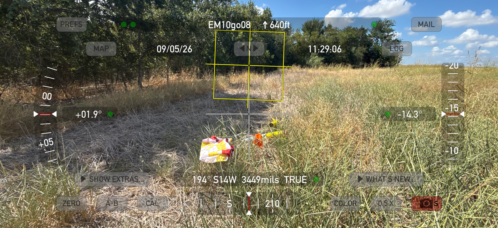

# Two-spotter visual fix for rocket recovery

Triangulating a landing point from two bearings.

**[Read it with pictures](https://bujw.github.io/starduster/bearing-fix/)** ·
**[Open the calculator](https://bujw.github.io/starduster/bearing-fix/calculator.html)**

A visual bearing is only valid from the position it was taken. Cross any terrain
on the way to recovery and there's no way to re-establish it.

Two spotters at known positions, each recording a bearing to the same landing,
define an intersection. That intersection is a coordinate you can enter into a
handheld and navigate to without line of sight.

## Method

Two spotters stand 100-150 m apart. On landing, each puts the crosshair of the
[Theodolite](https://hunter.pairsite.com/theodolite/) app on the spot and presses
MAIL. The app sends a KML holding the phone's position and the bearing it was
pointed, at full precision. Both files go to whoever is running the calculator,
and the intersection comes back as a coordinate.

## Field test, 16 September 2026

Two positions 152 m apart on the Baylor campus, both sighting a building cupola
about 350 m away. Bearings were 061° and 036° true, crossing at 25°.





Straight down on the computed fix. The marker sits essentially on the cupola.



| | |
|---|---|
| Spotter A → fix | 347 m |
| Spotter B → fix | 352 m |
| Spotter A ↔ Spotter B | 152 m |
| Crossing angle | 25° |
| Computed fix | 31.548139, −97.112414 |

The marker is clamped to ground while the cupola is about 25 m up, which accounts
for the apparent offset in the oblique views.

### Occlusion

The target was clear from one end of the baseline and behind a tree from the
other. The fix does not require both spotters to have an unobstructed view at the
same instant.







### Source observations

| Spotter | Time | Position | Bearing |
|---|---|---|---|
| A | 13:29:28 | 31.545604, −97.114565 | 036° TRUE |
| B | 13:27:45 | 31.546598, −97.115661 | 061° TRUE |




## The calculator

[bujw.github.io/starduster/bearing-fix/calculator.html](https://bujw.github.io/starduster/bearing-fix/calculator.html)

A single self-contained page — drop in the Theodolite CSV logs and it returns the
intersection, an error ellipse, and a KML for Google Earth. No server, nothing
uploaded, works offline once loaded.

To try it, load `sighting-a-2026-09-16.kml` and `sighting-b-2026-09-16.kml`.

## Setup

Theodolite settings, both phones:

- Coordinates in **decimal degrees** — not Maidenhead grid, not MGRS
- Heading set to **TRUE**
- Leave **ZERO mode off**; it changes what gets written to the log

Placement drives accuracy more than anything else. The two spotters should
straddle the landing area on a line roughly perpendicular to the drift direction,
not both stand on the flight line. Shallow crossing angles produce a fix stretched
along the line of sight.

MAIL sends one observation per message, so there is nothing to untangle at the
other end. If you use the cumulative CSV log instead, put the flight card number
in the app's note field.

## Why



Two rockets in waist-high grass. Not visible from fifteen yards, and both landed
in open view of everyone watching.



This one cleared the treeline by a few yards. It was only found because I happened
to be on the far side of the grove.

## What's next

I'd like to fly a rocket carrying a tracker we already trust and compare three
things per flight: the two-spotter fix, the tracker's final reported position, and
a GPS reading taken standing at the rocket. The last one matters — a tracker's
last transmission and the rocket's resting place are not always the same, and
without the walk-up reading there is no way to tell which is wrong.

This does not replace a tracker. If you have one, use it. This is for the
untracked flights.

## Files

```
index.html                       illustrated writeup (the Pages landing page)
calculator.html                  the calculator
sighting-a-2026-09-16.kml        a mailed observation, ready to load
sighting-b-2026-09-16.kml        the matching one from the other spotter
sighting-2026-09-16.csv          the earlier pair, in CSV form
bearing-fix-2026-09-16.kml       spotter positions, sight lines, and fix for Google Earth
proposal.txt                     short writeup for the club message board
*.png / *.jpeg                   screenshots
```

Josh / W3ARD
